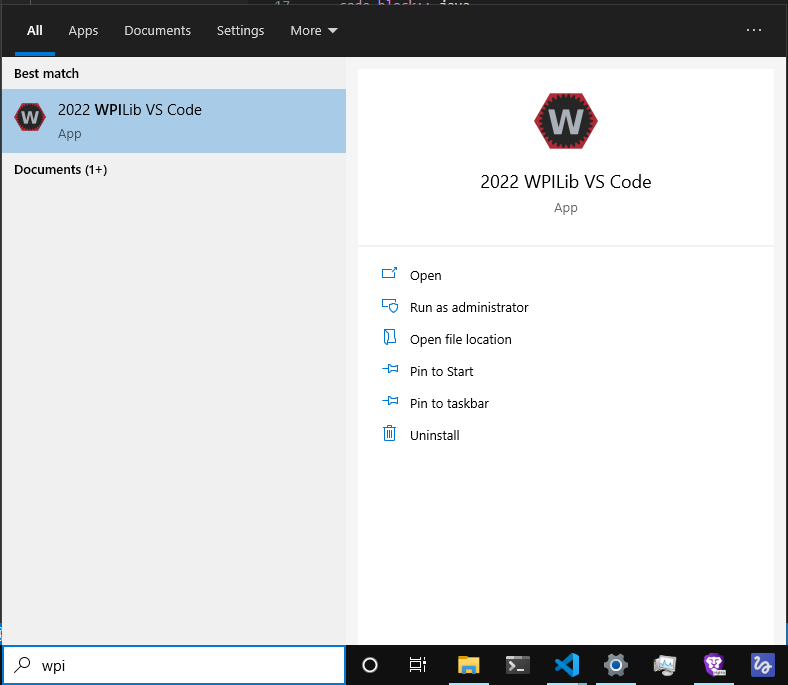
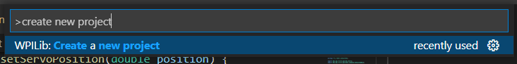
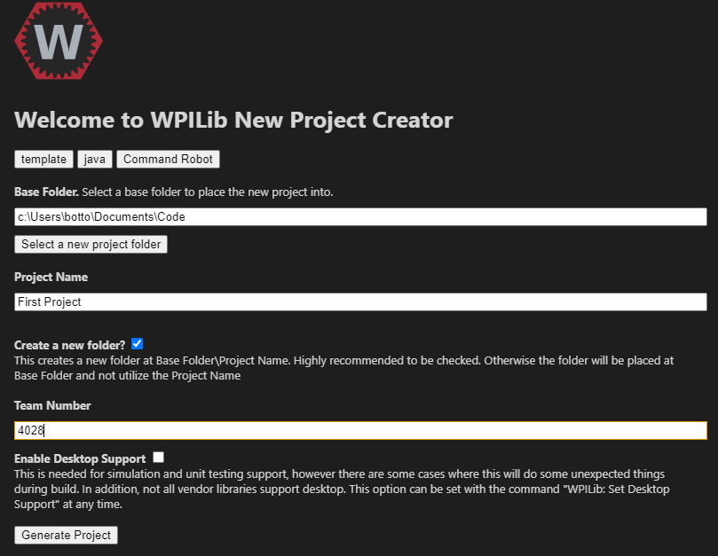

Section 1: Creating a Project
========================================

Creating a Project
-------------------

Begin by opening the WPILib VSCode installed in the previous section.
This can be done through the start menu (see below) on Windows, or through
Spotlight Search on MacOS.

VSCode may guide you through some initial setup. You can ignore most of this.
When you're done with the setup, begin by hitting `Ctrl+Shift+P` (Note: most of the time,
on MacOS, replace `Ctrl` with `Command`. If this is not the case, it will be noted.)

This should open up the "Command Palette". From here, type "create new project". You should
see something akin to this:

Select this option, and you will be greeted with a "New Project Creator" menu.
Begin by selecting a project type. Select "template", then "java", and finally,
"Command Robot". From here, select your base folder; it's recommended to create a
separate "code" folder somewhere--i.e. in your Documents folder.

The project name can be anything--for now, we can call it "First Project". Make sure
"Create a new folder?" is checked, and input your team number (i.e. 4028). In the end,
your screen should look something like this:

Finally, select "Yes (Current Window)".

Congratulations! You've successfully created your first robot project!
