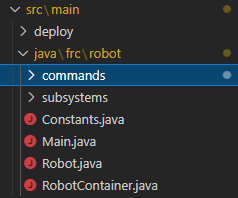
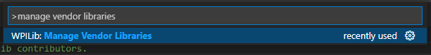
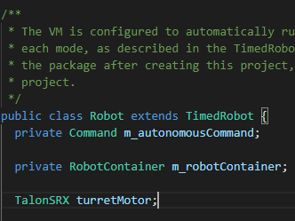
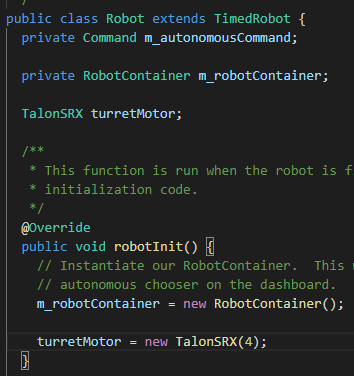
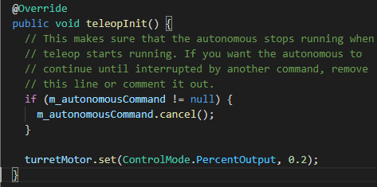

Section 2: Your First Motor
========================================

Running Your First Motor
-------------------------

.. warning:: 

    Make ABSOLUTELY SURE that you are using a Talon SRX motor controller for this!
    If you try to run a different motor controller, it will fail. Ask a mentor/teacher
    for help determining whether 

Firstly, we want to get into the main robot code. In your file tree on the left,
first hit "src", then "java". You will see 4 files there, and 2 folders.

Open "Robot.java" by clicking on it. This file contains the main logic for the robot
to run all of its code!

Before we create and run our motor, we need to install a "vendor dependency" for CTRE.
Vendor dependencies are libraries developed not by WPILib, but by external "vendors",
who manufacture motor controlls, gyroscopes, etc. In this case, we are running a CTRE
motor controller, so we need the CTRE vendor dependency.

Begin by opening the Command Palette again with `Ctrl+Shift+P`. Now type in
"manage vendor libraries". You should see the following:

Select it by pressing enter. Another menu should pop up. Hit "Install new libraries
(offline)". Select "CTRE Phoenix" and press enter. Select "Yes" to build.

Now, we can begin creating our project! Still in Robot.java, begin by going to the line
that says:

.. code-block:: java

    private RobotContainer m_robotContainer;

Put your cursor on the end of the line, and press Enter/Return twice. Now, we need to
create our motor controller object.

.. note::
    In Java, an "object" is an instance of a specific type;
    for example, a number, a string, or in this case a motor controller.

.. note:: 
    To create a "variable", that is, to store an object so you can use it later, we use the general
    format of `TypeName variableName`. For example, to create a string named "hello",
    we would do `String hello`.

In this case, we are creating a `TalonSRX` (our motor controller). We can call it anything
we want; for the time being, let's call it `turretMotor`. Thus, on our new line, we want to
type:

.. code-block:: java

    TalonSRX turretMotor;

.. note:: 
    When you type `TalonSRX`, a menu will pop up, with the variable name showing up first. Hit "enter"
    when you see this, and VSCode will automatically import the needed files to use the TalonSRX class.

.. note::
    In Java and most other programming languages, at the end of each line (or "statement"), we use
    semicolons (;) to determine that this is the end of the line. Semicolons are NOT OPTIONAL! When you
    have an error in your code, ALWAYS check your semicolons first and foremost!

.. note:: 
    In Java, almost all variables are named according to "camel case" notation. This specifies that
    the first "word" of the name is lowercase, and any subsequent "words" within the variable name
    have their first letters capitalized. There are exceptions, such as constants; these will be
    discussed later.

Your code should look like this:

.. note::
    TODO: Should we use codeblocks or images? Codeblocks are a bit easier to maintain...

If your code looks like this, you're good to move on. Scroll down until you see a "robotInit" function.

.. note:: 
    `teleopInit` is the code that runs when you first start the robot in "tele-operated" mode, shortened to "teleop",
    where in a real robot, the drivers have control over it.

.. note:: 
    A "function" is a set of instructions ("statements") that are executed when the function is "called".
    The definition of a function looks something like `ReturnType functionName() { ... }`, where ReturnType is the type
    of object the function will return at the end, and all statements to be executed are inside of the curly brackets `{}`.
    
    A function can be called with `functionName()` elsewhere in the code. You can freely assign a variable to the
    value returned by a function.

Set your cursor at the end of the line that says `m_robotContainer = new RobotContainer();`, and hit Enter twice.
We now need to "assign" a value to our motor variable. Assignment is done through the `=` operator, i.e.
`variableName = someValue;`.

.. note:: 
    When dealing with classes like `TalonSRX`, to create an "instance" of the object, we use the `new` keyword.
    For example, to create a new `TypeName`, one would write `variableName = new TypeName();`. The function called by `new`
    is called a "constructor". Some constructors may take arguments; this will be covered in a bit.

With this in mind, to assign to our turretMotor object, we must create a new TalonSRX object. The TalonSRX
constructor takes a single argument; the CAN ID of the motor controller. To determine the CAN ID... etc. Phoenix Tuner stuff

.. warning:: 
    So at this point I've already written down all the Java how-to... at this point should we point people to a
    Java learning site? Don't really feel like explaining some of this anymore...

In this case, our CAN ID should be 4. Thus, to "instantiate" (i.e. create) the `turretMotor`, we use:

.. code-block:: java

    turretMotor = new TalonSRX(4);

Don't forget the semicolon!

Your code should now look like this:

Now that we've created our motor, it's time to run it! Scroll down until you find the `teleopInit` function.
Inside of this function (below the autonomous command stuff), we need to "call" a method within the TalonSRX object.

In this case, the method is `<TalonSRX>.set()`. The `set()` method takes two parameters: the control mode (you'll learn
more about this later), and the "percent output", a value from -1 to 1, determining how fast the motor should run
(0 = stop, -1/1 = full speed), and which direction (>0 = forward, <0 = reverse). 

Begin by making two blank lines after the autonomous command stuff. Then, we need to call the `set()` function, with
our desired parameters. Begin by typing `turretMotor.set`. A menu should pop up, with the `set` method showing up,
with all of its parameters. Press enter to input this in. Now, replace `Mode` with `ControlMode.PercentOutput`
(ensuring to import ControlMode), and `demand` with our target speed. For safety and tutorial reasons, run it low, i.e.
0.2. In the end, your code should be:

.. code-block:: java

    turretMotor.set(ControlMode.PercentOutput, 0.2);

And will look like:

Connect to radio, deploy, enable, etc.
