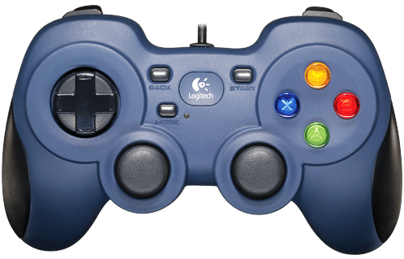
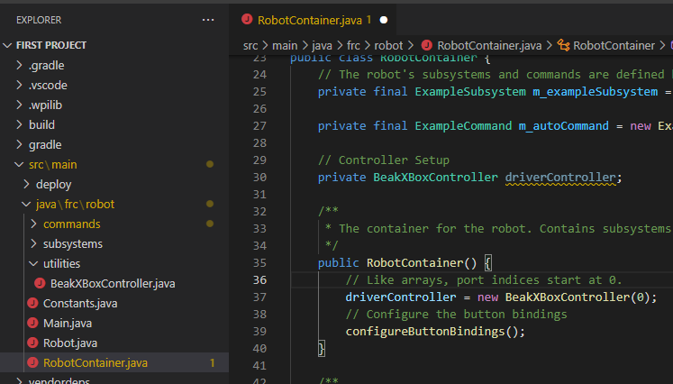
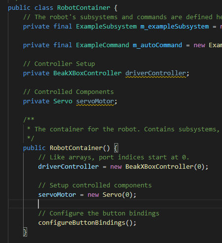

Section 4: Controllers
=======================

.. _setup:

Basic Setup
------------

Controllers do as their namesake: they control things. Ever played video games? You've used a controller. Ever used a keyboard and mouse? You've used a controller. In FRC, the controllers we use are similar if not identical to those found on consoles like Xbox.

But how do we use them?

For simplicity's sake, we will be using the BeakXboxController class as our wrapper around controllers. The BeakXboxController class itself wraps around the built-in WPILib class, XboxController, which provides functionality to use Xbox and Xbox-like controllers for robots. Buttons are mapped properly for an Xbox controller, and generally, this is how we give commands to the robot.

To start, get the BeakXboxController class. Go to `here <https://raw.githubusercontent.com/Team4028/2023-Drive/master/src/main/java/frc/robot/utilities/BeakXBoxController.java>`_. In the file that opens, select all and copy. Now, in your `robot` folder, create a new folder and call it `utilities`. From here, right-click on the utilities folder, and click "New File". Name the file `BeakXBoxController.java` (watch your capitalization!), and press enter. Now, delete whatever may be in the new file, and then press `Ctrl+V` to paste the BeakXBoxController class. You have successfully created your controller!

.. _codesetup:

Setup in Code
--------------

To use the BeakXboxController, we first need to create our controller instance. Go to your `RobotContainer.java` file, and in the `RobotContainer`'s member variable definitions, create a `private BeakXboxController`, and name it `driverController`.

Now, in your `RobotContainer` constructor, BEFORE `configureButtonBindings` is called, initialize your driver controller. The `BeakXBoxController` constructor takes one argument: the port. Controller ports start at 0, meaning that the "first" controller is actually port 0. We want to use the first controller, so plug in 0 for your port. Your code should now look something like this:

You've now set up a controller in code! Let's use it now.

.. _usage:

Usage
------

You may have learned about inline functions in your Java training. If not, what you need to know is that the basic form is `() -> functionToRun()`. Feel free to look up what inline functions are if you need more info. For now, all you need to know is that we plug this into the controller to run something. So, let's get started!

First of all, remember back to our previous lessons on servos, solenoids, and motors? Remember how you had to redeploy code every time you changed a value? Well, in competition, you *can't* redeploy code to change values! Thus, one of the many ways we change values "on-the-fly" is through controllers. For example, you can press one button to run a servo to a shortened position, and another to run it to an elongated position. That's exactly what we'll be doing here.

To start in code, we first need to stop anything from being done automatically in teleop. Go to `Robot.java` and remove all 3 `set()` calls in `teleopInit`. We won't be needing these anymore. Now, remove your definition and initialization of your `servoMotor`, and place it into `RobotContainer.java`. Your `RobotContainer` should look like this:

Now, how do we control it? We bind it! Binding means effectively mapping a button press to an action to be performed on the robot. With the `BeakXBoxController` class, this is easy! Scroll down to the `configureButtonBindings` method. This function is where we bind all our buttons.

To bind to a specific button with `BeakXBoxController`, you can access the buttons themselves, for example, `driverController.a` accesses the A button. To bind a command to that button, call `.whenPressed` of the button. Now to input your command, use the inline function notation you just learned about. We're going to bind the A button to the shortened position of the servo; thus, we put in `() -> servoMotor.set(0.2)`. Don't forget your semicolon at the very end of the line. Your code should look like this:

.. code-block:: java

	private void configureButtonBindings() {
		driverController.a.whenPressed(() -> servoMotor.set(0.2));
	}

If everything looks good, deploy your code. Now, you need to plug in a controller to the driver station, and verify that the controller is in the correct place. Plug in a controller to your driver station computer (via USB), and open the driver station. On the left, you will see a USB icon. Press this icon, and you should now see a list, and the first item should be "0 Controller (Gamepad F310)". This means it's plugged in correctly. If the first number is different, click and drag the controller to the first slot until it says 0. Now, to verify that it works and is in the correct port, press any button on the controller. In the driver station, the controller should now light up green, like this:

.. image:: images/sect4/ds-controller.png
  :alt: Controller in Driver Station
  :width: 500

Your controller is now good to go. Enable, and you will see that nothing happens. This is normal--there's nothing scheduled to happen! To see something happen, press A on your controller, and you will see the servo move to the retracted position!

But if you press it again, nothing happens. If you want to move it between positions, we need another position to be bound. Bind B to the fully lengthened position (1.0). Your code should now look like this:

.. code-block:: java

	private void configureButtonBindings() {
		driverController.a.whenPressed(() -> servoMotor.set(0.2));
		driverController.b.whenPressed(() -> servoMotor.set(1.0));
	}

Deploy and enable. Press B and it should go to the fully lengthened position. Then, press A, and it'll go back! This, fundamentally, is how we manage the state of the robot. We press different buttons, and they do different things. Now, you have control over whatever you want, without having to redeploy!

Congratulations on your work! Controllers will be used exclusively in the next few modules, so make sure you understand everything. Try out some things on your own. Bind X to some other position. Bind Y to running a motor. Bind the right bumper (known in code as `rb`) to toggle the solenoid. The world is your oyster when it comes to controllers!
