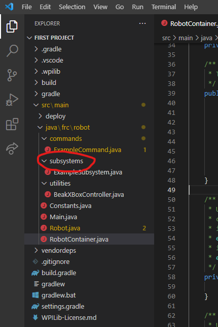
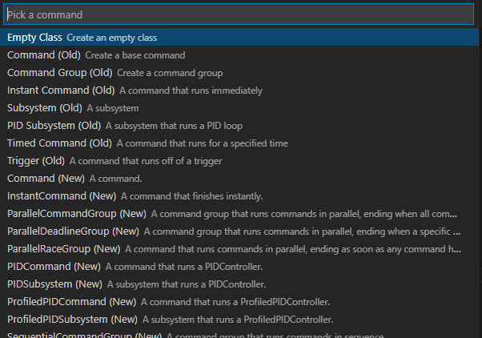
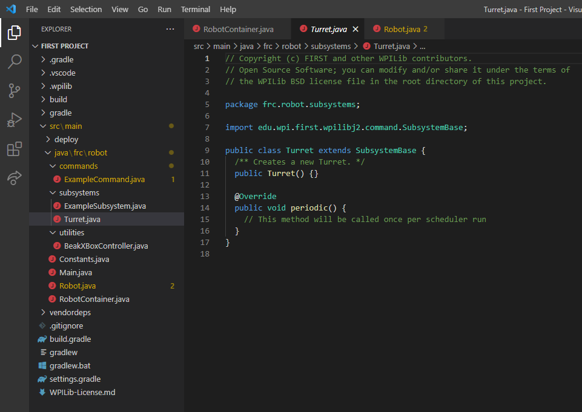
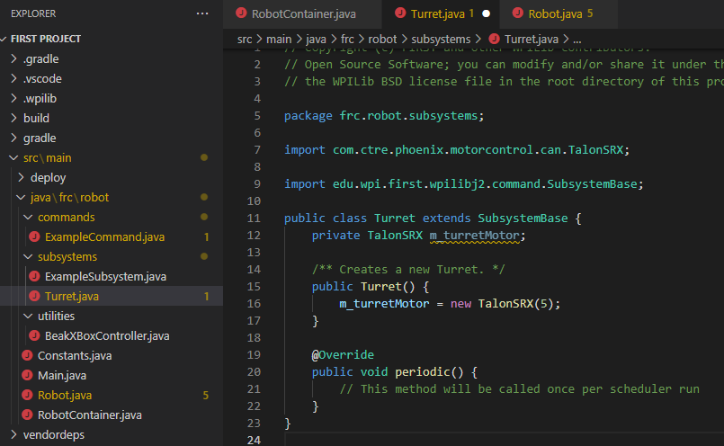
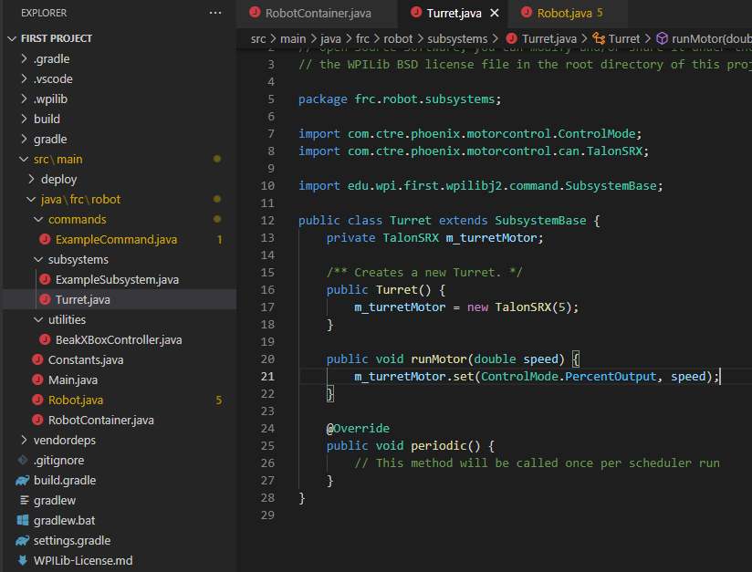
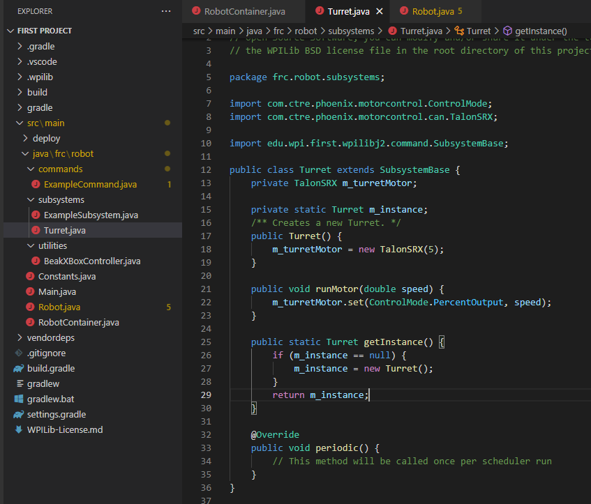
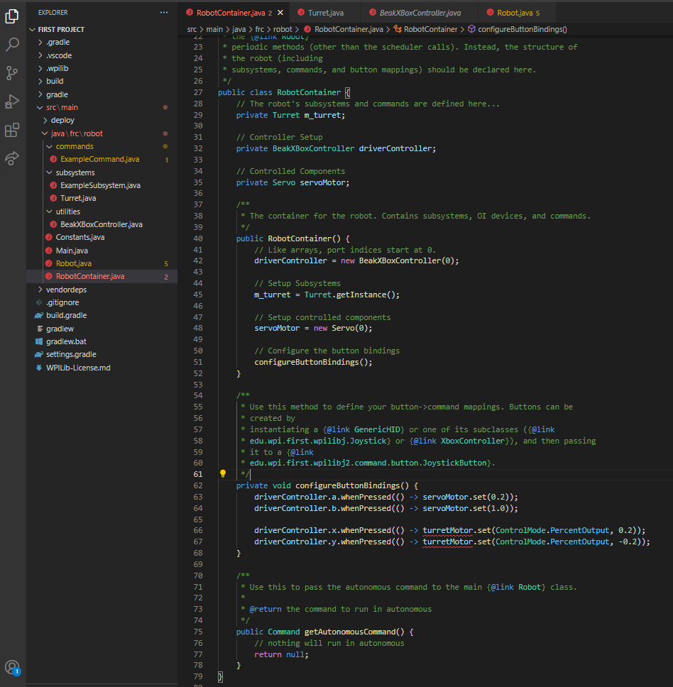
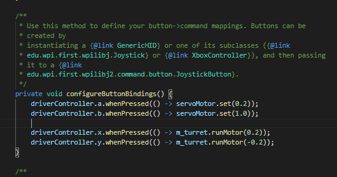

Section 7: Subsystems
======================

So far, all of our robot code has been in two files: Robot.java and RobotContainer.java. So far, it's worked well; and it *is* possible to write a functioning robot this way. However, this is a very inefficient and clunky method for creating a robot. Once you have more than one or two motors, it ends up being clunky and wasteful. It's even more clunky and wasteful when you have complicated algorithms, autonomous routines, and dozens of motors, sensors, servos, solenoids, cameras, and everything else!

We solve this fundamental problem with the use of **subsystems**.

.. _what:

What Are Subsystems?
---------------------

A subsystem, in its most literal, etymological form, means "under the system". In this case, the "system" is the robot as a whole. Therefore, a subsystem is a small part of the robot. What a "part" is depends on the robot. Physically, a subsystem is generally a group of related motors, sensors, servos, and solenoids that all work together to control a specific component of the robot. Programming wise, it consists of a group of motor controllers that run these related motors, as well as algorithms that combine the functionality of all of these 

If that made no sense to you, good. If it did make sense, even better. Here are some examples of what a subsystem might look like.

.. note:: 
	TODO: add pictures?

**Drivetrain**: A drivetrain, well, drives a robot! This is *the* universal constant for every competitive FRC robot in existence. It doesn't matter the game or how good the robot is, it has a drivetrain. A drivetrain consists of the following:

* Drive motors: generally 4 or 6, or if using swerve, 8 (4 for driving and 4 for turning individual wheels). Alternatively, `if you're 2481, you use 10 <https://www.chiefdelphi.com/t/roboteers-team-2481-2022-robot-reveal/405919>`_.
* Encoders for the wheels: used for autonomous control and knowing how far the robot has driven.

A drivetrain has rather simple control: driving and turning. In the code, you would implement simple algorithms to run the drive wheels. That's it.

**Shooter**: Used in shooting games to, well, shoot balls. Shooters tend to consist of the following:

* Shooter wheels: generally 1 or 2 sets of wheels. These wheels generally need to be run at a specific speed every time.
* Camera: used to get the distance and angle to the target.
* Hood adjustment: usually a servo or a motor that adjusts the angle of the "hood" of the shooter, allowing for a ball to be shot higher or lower, or farther or closer.

In the code, a shooter subsystem would use the camera to find the correct distance, calculate the speed needed for the shooter motors and the angle needed for the hood, to make a shot, and plug those values into the adjustment motor and shooter motors.

Now that we know WHAT a subsystem is, it's time to make one.

.. _creating:

Creating a Subsystem
---------------------

In your file tree, you should see a folder named "subsystems." As the name implies, this is where we store subsystems.

In the subsystems folder, there should already be a subsystem named "ExampleSubsystem". We don't need to care about this for now. Instead, let's make our own, from scratch!

Right-click on the subsystems folder. At the bottom of the menu that appears, click "Create a new class/command." From here, you will see a menu like this:

Now, type "Subsystem". Several options will show up, but for now, all we need is ``Subsystem (New)``, so select that.

.. warning:: 
	
	Make sure you select ``Subsystem (New)``, NOT ``Subsystem (Old)``. Old subsystems WILL NOT work!

Now, what should our subsystem be? So far, we have three components: a servo, a turret, and a solenoid. None of these are really related to each other, so let's start off with the turret. In order to make it sensical, name it something simple; ``Turret`` will do just fine, so type that in the next menu that appears, and press ``Enter``.

Now, your screen should look like this:

.. _setup:

Setting Up a Basic Subsystem
-----------------------------

The turret only has one thing: the turret motor! Therefore, we must setup our turret motor here once more. However, when we name variables within subsystems and other classes, we must follow strict naming conventions in order to keep our code consistent and readable. Before continuing, take the time to read the naming conventions section in the :doc:`/ref`.

Now that you've read the naming conventions, let's begin to make our subsystem. First of all, the turret motor needs to be a private member variable, meaning it needs to be prefixed with ``m_``. Therefore, our turret motor variable name will be ``m_turretMotor``:

.. code-block:: java

	private TalonSRX m_turretMotor;

Now, initialize it the same way you did in RobotContainer, initializing in the constructor:

.. code-block:: java

	public Turret() {
		m_turretMotor = new TalonSRX(5);
	}

Your code should now look like this:

Now that we've set up the motor itself, we need to implement some way to control it. Let's start with the basics: running the motor. Recall back to your Java training; to do anything with a class instance, we need method functions. So, let's make one.

This method should have a name that makes sense, so let's name it ``runMotor``. It should be ``public``, return nothing, and will take one parameter: the motor speed, which should be a ``double``. With this information, create the method. It should look like this:

.. note:: 
	Method functions are ALWAYS put between the constructor (``public Turret()``) and the final ``periodic()`` function.

.. code-block:: java

	public void runMotor(double speed) {

	}

Now, we need this function to do something. Inside of the method, we need to call ``.set()`` on our motor, and pass in the speed that was passed into the method. Your code should now look like this:

.. _instance:

Setting Up a Subsystem Instance
--------------------------------

Finally, we need to implement a subsystem instance. Normally, to get an "instance" of a class/subsystem, we would call ``new Turret()``. In an effort to simplify things, however, we simply create an instance within the class, and whenever we need to use the subsystem, we use this one common instance. Instantiating a subsystem more than once will cause errors.

We begin by creating an instance variable. This instance variable MUST be ``private static``, its type will be the subsystem itself (``Turret``), and we will name it ``m_instance``:

.. code-block:: java

	private static Turret m_instance;

Place this after all other variable declarations, but BEFORE the constructor.

:ref:`guides/cross-referencing-with-sphinx:explicit targets`

Next, we need to create a function to *get* that instance. In the Instances section of the :doc:`/ref`, copy the ``getInstance()`` function shown. Place this function between the last method (``runMotor``) and the ``periodic`` method. Replace ``SubsystemName`` with the name of our subsystem, ``Turret``. Now, your code should look like this:

Our subsystem is now fully set up! Next, let's begin implementing it with the rest of the robot!

.. note:: 

	Literally all of this will need to be changed once I add the encoders and limit switches section. Unless we put subsystems and commands before that? I mean, subsystems and commands are so incredibly fundamental that it's probably more worth it putting it before those. And it's also more applicable when encoders and limit switches are put into subsystems and commands, as it shows what you really end up doing.

.. _implementing:

Implementing in RobotContainer
------------------------------

We've set up a subsystem and now can get an instance, so we can finally use it within the rest of the code!

First, let's clean up RobotContainer a bit. Remove the definitions for ``exampleCommand`` and ``exampleSubsystem`` at the top of the class; we won't need those anymore. Replace the ``return m_autoCommand`` at the end of the file with ``return null;``.

Now, we need to convert all our motor control with the new Turret subsystem!

If you have any ``TalonSRX`` objects defined, remove them. Ignore the errors in ``configureButtonBindings`` for now. Let's replace it with a subsystem! Where ``exampleSubsystem`` was defined before, define your turret subsystem; it should be ``private``, of type ``Turret``, and must also follow naming conventions; thus, we will call it ``private Turret m_turret;``.

In the ``RobotContainer`` constructor, we must initialize the turret. In the constructor, set ``m_turret`` to ``Turret.getInstance()``. That's it! You've initialized a Turret! Your code should look something like this:

Let's fix those errors we see. In our Turret subsystem, we defined a function ``runMotor`` that calls ``.set()`` on the TalonSRX. Therefore, wherever we have ``turretMotor.set()`` in ``configureButtonBindings``, replace it with ``m_turret.runMotor()``. Keep in mind, the ``runMotor`` method doesn't need a ``ControlMode``. For example:

.. code-block:: java

  turretMotor.set(ControlMode.PercentOutput, 0.2);

Becomes:

.. code-block:: java

  m_turret.runMotor(0.2);

Replace all your ``set`` calls with this new syntax. Your ``configureButtonBindings`` could now look like this:

When there are no errors left and everything looks good, deploy your code. Try out your newly subsystem-ified buttons and see if they work! If not, ask a mentor or captain for help (and yes, screaming "CARSON!!!!" across the room is perfectly acceptable.)
